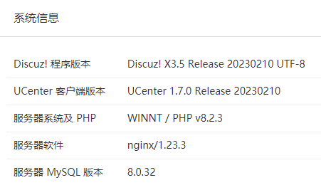

```markdown
为方便站长基于 Discuz! X 搭建网站，[Discuz! 应用中心](https://addon.dismall.com/) 为站长提供免费安装 Discuz! X 的服务，详情咨询QQ 1453650

### **安装、升级教程**
使用发布版的用户，查阅安装包中的 readme.html 文件，使用码云原版的用户，查看：[安装教程](https://gitee.com/Discuz/DiscuzX/wikis/安装教程?sort_id=3466132)、[升级教程](https://gitee.com/Discuz/DiscuzX/wikis/升级方法?sort_id=9978)

### **相关网站**
[Discuz! 官方网站](https://www.discuz.vip/)

- X3.2、X3.3、X3.4 已停更，无重大漏洞的情况下，将不再更新 X3.4 版本。请随时关注更新列表，您可进行手动修补，让自己的站点时刻保持最安全的状态!
- X3.5 已经于 2023 年 5 月 21 日切换为默认分支
- X5.0 分支[点击这里进入](https://gitee.com/Discuz/DiscuzX/tree/MitFrame/)

### 截图

```